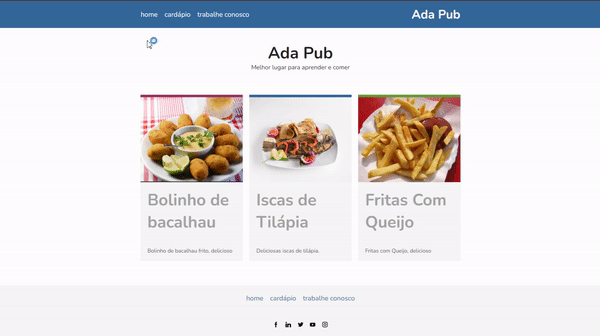

# 🍝 ADA Pub

<h2>ℹ️ Sobre o Projeto</h2>

<ul>
  <li>Front-end estático proposto pelo bootcamp ADA Tech para Aprimorar e consolidar habilidades em posicionamento de elementos utilizando grid e flexbox.</li>
  <li>Foram exploradas diferentes combinações de grid e flexbox.</li>
  <li>O projeto ajudou a elevar a compreensão e domínio de posicionamento e técnicas responsivas.</li>
</ul>

<h2>🛠️ Tecnologias Utilizadas</h2>

<ul>
  <li>HTML5</li>
  <li>CSS3</li>
</ul>

<h2>🌟 Recursos</h2>

<ul>
  <li>Uso de grid e flexbox para posicionamento de elementos.</li>
  <li>Interface visualmente atraente e intuitiva.</li>
  <li>Contém navegação entre páginas.</li>
  <li>Tabela e formulário de cadastro.</li>
</ul>

🎬 Demonstração do funcionamento das funcionalidades de navegação:

    

 

